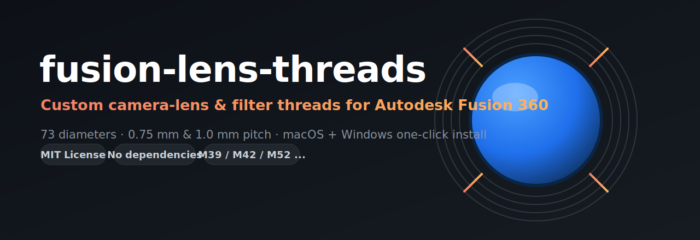
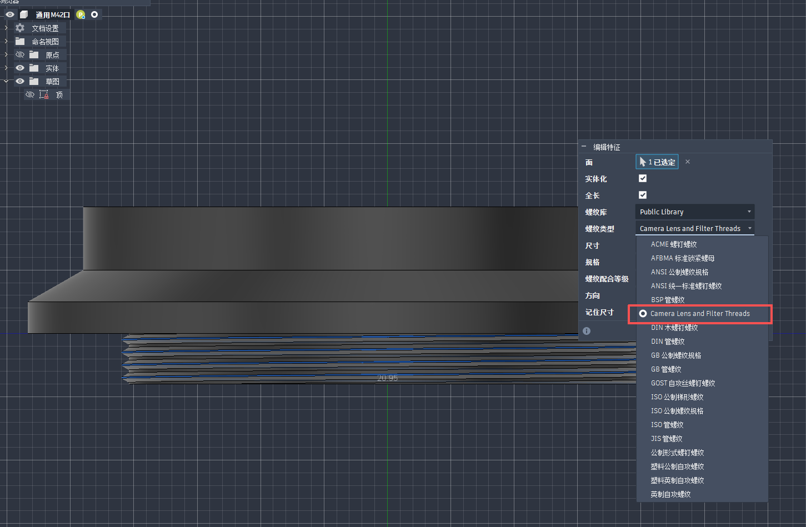
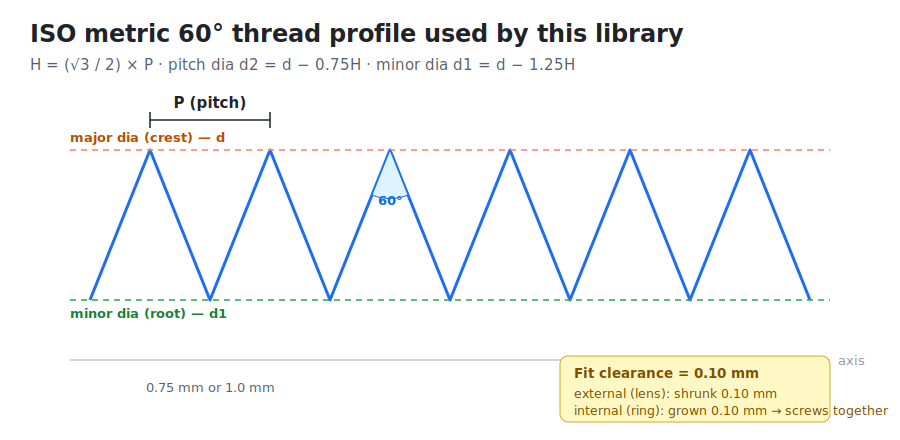
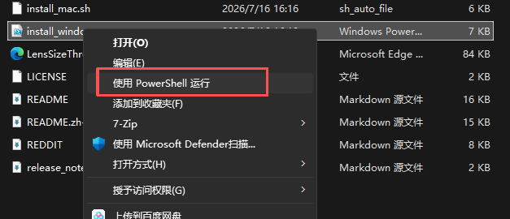
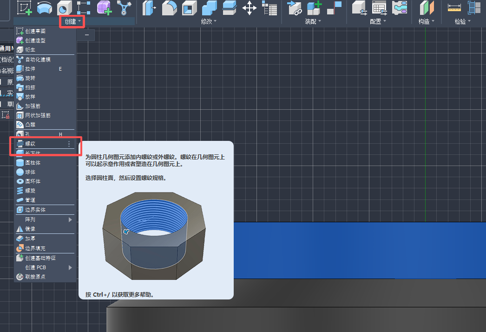
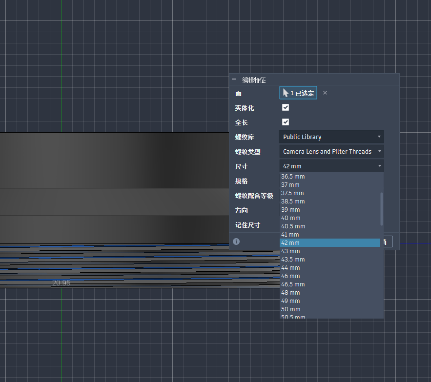
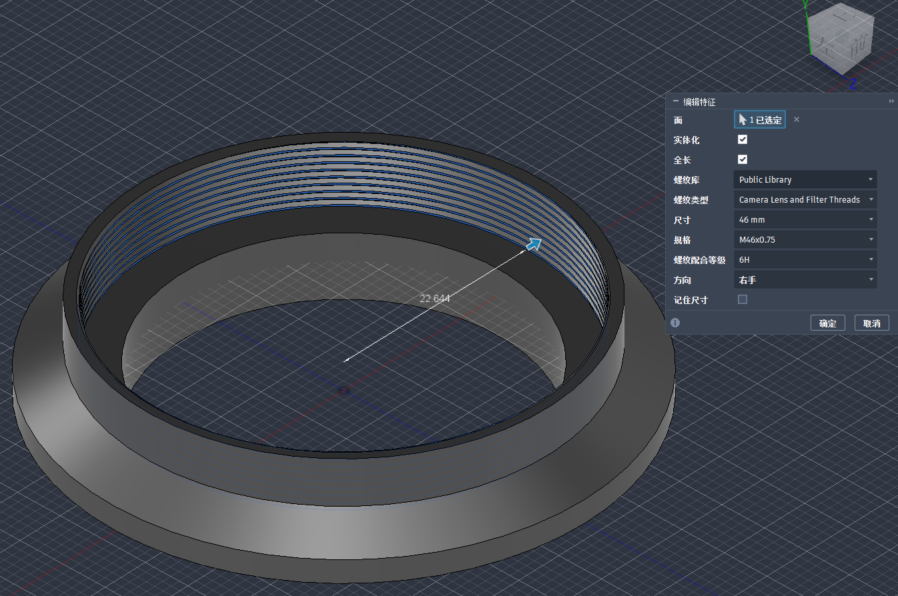

<!-- Language switch -->
**English** · [简体中文](README.zh-CN.md)

<p align="center">
  
</p>

<p align="center">
  <a href="LICENSE"></a>
  
  
  
  
  <a href="#contributing"></a>
</p>

> A one-click custom thread library that adds **every common camera-lens and
> filter thread** (M39, M40, M42, M43 … up to 127 mm) to Autodesk Fusion 360 —
> each in **both 0.75 mm and 1.0 mm pitch**, with proper clearance so parts
> actually screw together. macOS & Windows installers, zero runtime dependencies.

<p align="center">
  <!-- 📷 IMAGE #3 (the money shot): Fusion Thread dialog with the Thread Type
       dropdown open, showing "Camera Lens and Filter Threads" highlighted. See docs/images/README.md -->
  
  <br><em>After installing, the <strong>Camera Lens and Filter Threads</strong> family shows up right in the Thread command.</em>
</p>

---

## Table of contents

- [Why this exists](#why-this-exists)
- [Features](#features)
- [Supported sizes & pitches](#supported-sizes--pitches)
- [Which pitch: 0.75 vs 1.0 mm](#which-pitch-075-vs-10-mm)
- [Requirements](#requirements)
- [Installation](#installation)
  - [macOS](#macos)
  - [Windows](#windows)
  - [Manual install (any OS)](#manual-install-any-os)
- [Using it in Fusion 360](#using-it-in-fusion-360)
- [After a Fusion 360 update](#after-a-fusion-360-update)
- [Troubleshooting](#troubleshooting)
- [How it works](#how-it-works)
- [Customizing / development](#customizing--development)
- [Contributing](#contributing)
- [License](#license)
- [Acknowledgements](#acknowledgements)

---

## Why this exists

Fusion 360 ships with standard ISO / UTS thread tables, but **photographic lens
and filter threads are not in there** — things like the M42 lens mount, M39
(Leica screw mount), or the dozens of filter-ring diameters (49 mm, 52 mm,
77 mm …). If you 3D-print or machine lens adapters, filter rings, step-up rings,
or custom mounts, you normally have to hand-model each thread.

This project drops a ready-made thread family into Fusion so you can just pick
the size and pitch from the dropdown — like any built-in thread.

## Features

- 🔍 **Auto-detects** your Fusion 360 `ThreadData` folder (newest installed
  version) on macOS and Windows — no hunting through hidden app folders.
- 📦 **73 diameters** covering the full common lens/filter range (24 – 127 mm).
- 🎯 **Two pitches per size** — `0.75 mm` and `1.0 mm` (e.g. `M42x1` mount and
  `M42x0.75` filter thread).
- 🔩 **External (6g) + internal (6H)** for every entry, with a 0.10 mm fit
  clearance so an external thread screws into an internal one of the same size.
- 🪶 **Zero runtime dependencies** — macOS uses the built-in `bash`, Windows uses
  the built-in `PowerShell`. No Python required to install.
- 🧪 **Tested** — a Python generator + test harness verify all three generators
  (Python / bash / PowerShell) produce identical, valid Fusion XML.
- 🛠️ **Hackable** — change one list to add your own sizes or pitches.

## Supported sizes & pitches

All diameters (mm), each available in **0.75 mm** and **1.0 mm** pitch:

```
24    25    25.5  27    28    30    30.5  34    35.5  36    36.5  37    37.5
38.5  39    40    40.5  41    42    43    43.5  44    46    46.5  48    49
50    50.5  52    54    55    56    58    60    62    64    67    70    72
74    75    76    77    78    80    82    84    85    86    87    90    92
94    95    96    98    100   102   104   105   107   108   110   112   114
116   118   120   122   124   125   126   127
```

That's **73 sizes × 2 pitches × (external + internal) = 292 thread definitions**.
The commonly requested `M39`, `M40`, `M42`, `M43` are all included.

## Which pitch should I use? 0.75 mm vs 1.0 mm

Both pitches exist for a reason: **the same diameter number can be a filter
thread (0.75 mm) or a lens mount (1.0 mm)** — the pitch is what tells them
apart.

**Quick rule**
- **0.75 mm** → the thread on the *front of a lens* (where you screw
  UV/ND/CPL filters, lens caps, hoods, step-up rings). This is the
  photographic standard for filter threads up to ~86 mm.
- **1.0 mm** → (a) **large filter diameters** (95, 105, 112, 120, 127 mm),
  and (b) **screw lens mounts** like `M42×1` (Pentax/Praktica SLR) and
  `M39×1` (Leica Thread Mount rangefinder).

| You are modeling… | Use | Examples |
|---|---|---|
| A screw-in filter, cap, hood, or filter step-ring (≤ 86 mm) | **0.75 mm** | 49, 52, 67, 77 mm filter threads |
| A large filter accessory (≥ 95 mm) | **1.0 mm** | 95, 105, 112, 120, 127 mm |
| An adapter to a vintage screw-mount lens | **1.0 mm** | `M42×1` mount, `M39×1` LTM |
| Unsure / generic filter part | default to **0.75 mm** | safe choice |

**Concrete size notes (the ones people mix up)**
- **M39**: `M39×0.75` = a 39 mm filter thread; `M39×1.0` = Leica Thread
  Mount (rangefinder lens). Same number, different use.
- **M40 / 40.5**: filter threads → `0.75 mm`.
- **M42**: `M42×0.75` = 42 mm filter thread; `M42×1.0` = the famous SLR
  screw mount (use 1.0 for adapters).
- **M43**: filter thread → `0.75 mm`.

In Fusion 360, just pick the matching designation in the *Designation* dropdown
— see the designation image in
[Using it in Fusion 360](#using-it-in-fusion-360) for both pitches side by side.

<p align="center">
  
</p>

## Requirements

- Autodesk Fusion 360 (any recent version) installed.
- macOS **or** Windows. No Python, no plugins, no admin rights needed for the
  default install.

---

## Installation

> **TL;DR:** run one script → **restart Fusion 360** → pick
> `Camera Lens and Filter Threads` in the Thread dialog. Three steps, done.

First, get the files — either **clone** or **download the ZIP** from the green
`Code` button on GitHub and unzip it:

```bash
git clone https://github.com/HairuoLiu/fusion-lens-threads.git
cd fusion-lens-threads
```

### macOS

**Step 1 — Run the installer**

```bash
chmod +x install_mac.sh
./install_mac.sh
```

The script finds your Fusion `ThreadData` folder automatically and writes
`LensSizeThreads.xml` into it.

<p align="center">
  <!-- 📷 IMAGE #4: Terminal showing install_mac.sh success output + the path it wrote to -->
  
</p>

**Step 2 — Restart Fusion 360** (fully quit and reopen).

**Step 3 — Verify:** open the Thread command and look for `Camera Lens and Filter Threads`
in the Thread Type dropdown. Done ✅

Handy flags:

```bash
./install_mac.sh --dry-run                 # just print where it WOULD install
./install_mac.sh --output /path/ThreadData # install to a specific folder
```

### Windows

**Step 1 — Run the installer** (PowerShell):

```powershell
powershell -ExecutionPolicy Bypass -File install_windows.ps1
```

> If Windows blocks the script, the `-ExecutionPolicy Bypass` flag above already
> handles it for this one run — you don't need to change any system settings.

<p align="center">
  <!-- 📷 IMAGE #5: PowerShell showing install_windows.ps1 success output + target path -->
  
</p>

**Step 2 — Restart Fusion 360** (fully quit and reopen).

**Step 3 — Verify:** open the Thread command → the Thread Type dropdown now
lists `Camera Lens and Filter Threads`. Done ✅

Handy flags:

```powershell
powershell -ExecutionPolicy Bypass -File install_windows.ps1 -WhatIf
powershell -ExecutionPolicy Bypass -File install_windows.ps1 -OutputDir "C:\path\to\ThreadData"
```

### Manual install (any OS)

If auto-detection fails (unusual install location), copy the pre-built XML
yourself:

1. Grab `LensSizeThreads.xml` from this repo.
2. Drop it into your Fusion `ThreadData` folder:
   - **macOS:**
     `~/Library/Application Support/Autodesk/Webdeploy/production/<version-id>/Autodesk Fusion 360.app/Contents/Libraries/Applications/Fusion/Fusion/Server/Fusion/Configuration/ThreadData`
   - **Windows:**
     `%LOCALAPPDATA%\Autodesk\webdeploy\Production\<version-id>\Fusion\Server\fusion\Configuration\ThreadData`
   - Pick the **newest** `<version-id>` folder if there are several.
3. Restart Fusion 360.

<p align="center">
  <!-- 📷 IMAGE #10 (optional): File Explorer/Finder showing ThreadData with LensSizeThreads.xml inside -->
  
</p>

---

## Using it in Fusion 360

**1. Make a cylinder** (or a hole) to thread.

**2. `Create → Thread`.**

<p align="center">
  <!-- 📷 IMAGE #6: Fusion ribbon Create → Thread highlighted -->
  
</p>

**3.** Tick **Modeled** (so the thread is real geometry, not just cosmetic), then
set **Thread Type → `Camera Lens and Filter Threads`**.

**4.** Choose **Size** and **Designation** — e.g. `M42x1` for an M42 mount, or
`M42x0.75` for a 42 mm filter thread.

<p align="center">
  <!-- 📷 IMAGE #8: the Designation dropdown open, showing M42x1 / M42x0.75 / M39x1 ... -->
  
</p>

**5.** For an internal thread (a ring the lens screws into), also tick
**Internal**. Click **OK**.

<p align="center">
  <!-- 📷 IMAGE #7: full Thread dialog, Modeled checked, family + designation chosen, applied on a body -->
  
</p>

> **To make two parts screw together**, give the external part and the internal
> part the **same size and pitch** (e.g. both `M42x1`). The 0.10 mm clearance is
> already built in, so they'll thread together without editing.

<p align="center">
  <!-- 📷 IMAGE #9: photo/render of two printed parts screwed together -->
  
</p>

---

## After a Fusion 360 update

Every major Fusion update creates a **new** `ThreadData` version folder, and
custom XML is **not** migrated automatically. After an update, just **re-run the
installer** (it targets the newest version folder). You can also use the
community add-in [ThreadKeeper](https://github.com/thomasa88/ThreadKeeper) to
re-apply custom threads automatically after each update.

## Troubleshooting

| Symptom | Fix |
|---------|-----|
| `Camera Lens and Filter Threads` doesn't appear | Did you fully **restart** Fusion 360? Custom threads load at startup. |
| It appeared before but vanished | Fusion updated → new version folder. **Re-run the installer.** |
| Installer says "ThreadData not found" | Use `--output` / `-OutputDir` to point at the folder manually, or do the [manual install](#manual-install-any-os). |
| Windows: "running scripts is disabled" | Use the exact command with `-ExecutionPolicy Bypass` shown above. |
| Parts don't screw together | Make sure both parts use the **same size *and* pitch**; only one is Internal, the other External. |
| I need a size/pitch that isn't listed | See [Customizing](#customizing--development) — it's one line. |

## How it works

The generated XML follows the basic **ISO metric 60° profile**:

- `H = (√3 / 2) × pitch`
- pitch diameter `d2 = d − 0.75·H`
- minor diameter `d1 = d − 1.25·H`

External threads are shrunk by a `0.10 mm` allowance and internal threads grown
by the same amount, so a same-size external/internal pair mates with a light,
printable clearance. See `generate_lens_threads.py` for the exact math and the
Fusion XML schema (`<ThreadType> → <ThreadSize> → <Designation> → <Thread>`).

## Customizing / development

Add or remove sizes/pitches by editing two lists at the top of
`generate_lens_threads.py`:

```python
SIZES   = [24, 25, 25.5, ...]   # nominal diameters in mm
PITCHES = [0.75, 1.0]           # pitches in mm
```

Regenerate and validate (Python 3.8+):

```bash
python generate_lens_threads.py          # writes LensSizeThreads.xml
python tests/test_threads.py             # validates sizes/pitches/genders/diameters
python tests/compare_outputs.py \
    LensSizeThreads.xml \
    <mac_output>/LensSizeThreads.xml \
    <win_output>/LensSizeThreads.xml     # confirms all 3 generators match
```

The bash and PowerShell installers embed the same generator inline, so the three
implementations are kept byte-for-byte identical by `compare_outputs.py`.

### Project structure

```
fusion-lens-threads/
├── install_mac.sh            # macOS installer (auto-detect path + generate + write)
├── install_windows.ps1       # Windows installer (same, PowerShell, UTF-8 no BOM)
├── generate_lens_threads.py  # Python generator (cross-platform, for tweaking)
├── LensSizeThreads.xml       # pre-built output — copy manually if you like
├── tests/
│   ├── test_threads.py       # schema/geometry validation
│   └── compare_outputs.py    # cross-generator equality check
├── docs/images/              # README images (+ manifest of screenshots to add)
├── README.md                 # this file (English)
├── README.zh-CN.md           # 中文说明
├── REDDIT.md                 # launch/share guide for Reddit
└── LICENSE                   # MIT
```

## Contributing

Issues and PRs are welcome — especially:

- extra lens/filter sizes or non-standard pitches,
- Linux path detection,
- real-world screenshots/prints for the gallery.

Please run the tests above before opening a PR so all three generators stay in
sync.

## License

Released under the **MIT License** (SPDX identifier: [`MIT`](https://spdx.org/licenses/MIT.html)).
See [`LICENSE`](LICENSE) for the full text.

The MIT License itself is unversioned — there is a single canonical text — so
"MIT" fully identifies it. In short: free to use, copy, modify, merge, publish,
distribute, sublicense, and sell, provided the copyright and permission notice
are kept. Provided **as is**, without warranty.

```
SPDX-License-Identifier: MIT
Copyright (c) 2026 HairuoLiu
```

## Acknowledgements

- The Fusion 360 custom-thread XML format, documented by the community
  (incl. [Nightkurz/CustomThreads](https://github.com/Nightkurz/CustomThreads)).
- [ThreadKeeper](https://github.com/thomasa88/ThreadKeeper) for the
  survive-updates workflow.

---

<p align="center">
  <sub>Made for people who print lens adapters at 2 a.m. · Sharing this on Reddit? See <a href="REDDIT.md">REDDIT.md</a>.</sub>
</p>
